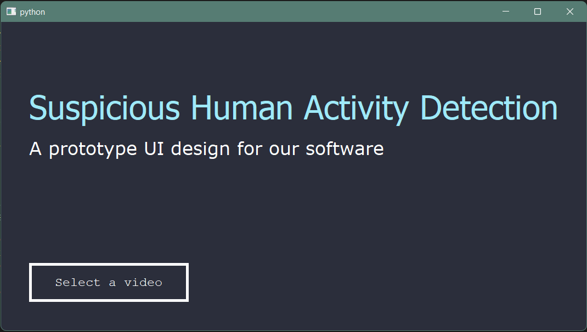

# Suspicious Human Activity Detection

## Overview

Our project, "Suspicious Human Activity Detection", aims at developing an AI-based Suspicious Activity Detector and deploying it as a desktop application. At the core of the system lies a Deep Learning model which can classify activities as “Suspicious”or “Normal” from video content. Upon receiving a number of frames from the video, the model will be able to process it and learn the best possible spatio-temporal features to perform classification. In this way, our model can operate on both types of data - full video files and live video streams from cameras.

In order to train our model, various human behaviors need to be specified as “Suspicious” and “Normal”. For this, we use the popular Kinetics-400 dataset. This large-scale dataset is standard in the field of Video Understanding and Action Recognition, and consists of thousands of video clips demonstrating over 400 different actions. To train our model, we label some of these actions, such as “sword fighting”, “punching”, etc. as “Suspicious” and the rest as “Normal”.

The end-product of our project will be a desktop application which will provide an interface to the user to run the classification model either on a video stored on the disk or on a live video stream. The user will be able to select the video or the stream ID from the UI. The software will then run the model and display the classification result as text. The application will serve as a product that can be used in sensitive places. Alerting mechanisms already in place can be incorporated into the application to raise the alerts when any suspicious activity is detected from the real-time camera feed. Since this micro-customisation is use-case dependent, we will define the scope of alerting as displaying a text on the screen.

## Protoype GUI

Created as BTech Semester Long Project for Sem-7

2019UCO1505 Nalin Semwal
2019UCO1514 Abhishek Jha
2019UCO1516 Kartik Goyal
2019UCO1596 Vatsal Dhar
